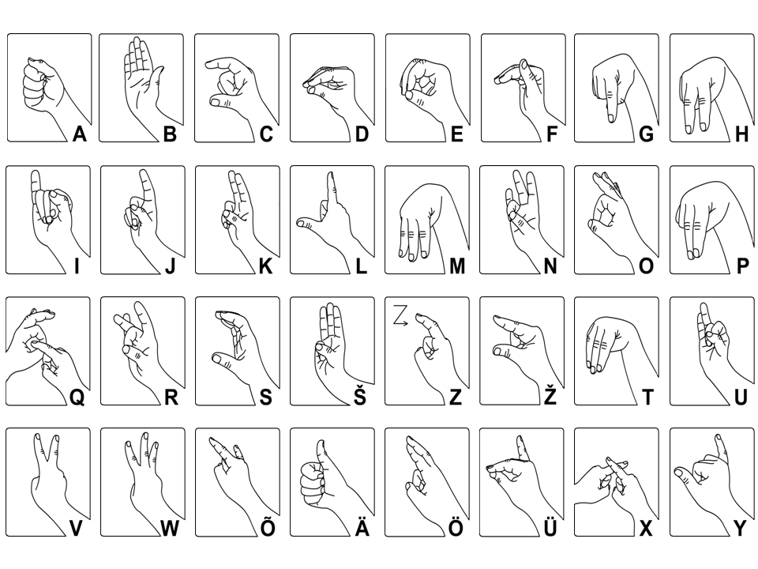

# Estonian Fingerspelling Recognition Model and Dataset
This project was created for the Introduction to Data Science course and aims to train a model to recognize Estonian fingerspelling signs. 

<figure>
    
    <figcaption>Estonian fingerspelling signs (Eesti Keele Instituut).</figcaption>
</figure>

## Dataset
The `data` folder contains a dataset of Estonian sign language fingerspelling signs for the 32 letters in the Estonian alphabet.
Each label is accompanied by over 200 images from 8 different individuals. 

## Scripts
The `scripts` folder contains Python scripts that we used for renaming and cropping the images.

## Training the model
A recognition model can be trained by running the Jupyter notebook in Colab or locally. When running locally, there may be some problems with Mediapipe when not using Linux.
Running the notebook takes about 30 minutes.
The Colab notebook is [here](https://colab.research.google.com/drive/1RgLQycIGeySCx58SFGnGl-DNT7RI3tMR?usp=sharing).

## References
The model training code is largely based on the [Hand Recognition Customization Guide](https://developers.google.com/mediapipe/solutions/customization/gesture_recognizer) by Mediapipe.
